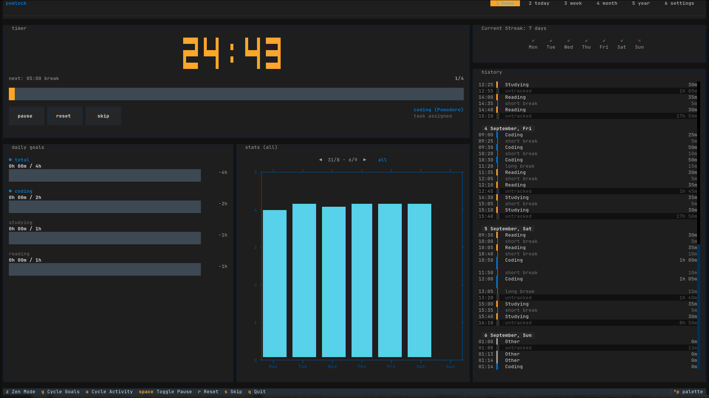

<div align="center">
  
</div>

# pomlock

pomlock is a Linux Pomodoro timer for developers who ignore timer notifications. When your break starts, it locks your keyboard and mouse through `evdev` and covers the screen with a countdown overlay. You cannot dismiss a popup or keep typing until the break ends.

I built pomlock because desktop notifications never worked on me. I would dismiss the alert and keep typing for hours until my wrists hurt. pomlock removes the choice so you actually step away from your desk.

## Demo

pomlock's interface is a terminal UI — the home screen, stats views, and break overlay all run in-terminal.



## Installation

Install pomlock using `pipx` or `uv`:

### pipx
```bash
pipx install pomlock
```

### uv
```bash
uv tool install pomlock
```

<!-- pomlock is also listed on [Terminal Trove](https://terminaltrove.com). -->


If you prefer to run without device locking, pass `--no-block-input`.

## Usage

Start pomlock with the default 25-minute work and 5-minute break cycle:

```bash
pomlock
```

### CLI Options

```bash
# Use a preset: standard (25/5), ultradian (90/20), or fifty_ten (50/10)
pomlock -t ultradian

# Set a custom cycle: 45m work, 10m short break, 20m long break, 3 cycles
pomlock -t "45 10 20 3"

# Tag the session with an activity
pomlock -a coding

# Disable keyboard and mouse blocking
pomlock --no-block-input

# List configured presets
pomlock --show-presets

# List configured activities and goals
pomlock --show-activities
```

## Controls

Navigate the interface with these keybindings:

| Key | Action |
| --- | --- |
| `Space` | Pause or resume timer |
| `s` | Skip current interval |
| `r` | Reset current interval |
| `z` | Toggle zen mode |
| `g` | Cycle activity goals |
| `a` | Cycle chart activity filter |
| `1` | Home screen |
| `2` - `5` | Today, Week, Month, and Year stats |
| `6` | Settings screen |
| `q` | Quit |

## Configuration

Settings live at `~/.config/pomlock/pomlock.conf`. You can edit this file directly or update values inside the app by pressing `6`.

Here is an example configuration:

```ini
[general]
block_input = true
notify = true
break_notify_msg = Time for a break!
long_break_notify_msg = Time for a long break!
pomo_notify_msg = Time for a pomodoro!
callback = 
timer = standard

[presets]
standard = 25 5 20 4
ultradian = 90 20 20 1
fifty_ten = 50 10 10 1
study = 50 5 10 4

[overlay]
enabled = true
font_size = 48
color = white
bg_color = black
opacity = 0.8

[activities]
auto_calc = false
daily = 1h

[streak]
allowed_gap = 1
indicator_style = icon

[localization]
week_start_day = sunday
locale = en_US

[pomodoro]
pomodoro = 25.0
short_break = 5.0
long_break = 20.0
cycles = 4

[activities.coding]
daily = 4h
weekly = 20h
color = bar-blue

[activities.other]
```

### Config Sections

- `[general]`: Configures input blocking, notification text, and event scripts.
- `[presets]`: Timers defined as `WORK SHORT_BREAK LONG_BREAK CYCLES` in minutes.
- `[overlay]`: Configures the full-screen break window. `opacity` accepts values from `0.0` to `1.0`.
- `[activities]`: When `auto_calc = true`, overall goals are calculated from individual activities. When `false`, explicit goals set here apply.
- `[activities.<name>]`: Goal targets (`daily`, `weekly`, `monthly`, `yearly`) and chart colors for a specific activity.
- `[streak]`: Daily streak tracker. `allowed_gap` sets allowed missed days before resetting a streak.
- `[localization]`: Calendar display options. `week_start_day` accepts `monday` or `sunday`.
- `[pomodoro]`: Stores the active session parameters.

## Integrations

### Status File Polling

pomlock writes its live state to `/tmp/pomlock.json` every second:

```json
{
  "action": "pomodoro",
  "time": 1500,
  "start_time": 1725580800.0,
  "crr-cycle": 1,
  "total-cycles": 4,
  "crr-session": 1,
  "state": "running"
}
```

Use this file to feed custom status bar widgets like Waybar or Polybar. The file is removed when pomlock exits.

### Waybar

A ready-made script is located at `src/pomlock/waybar.py`. Add this block to your Waybar configuration:

```json
"custom/pomodoro": {
    "exec": "python3 /path/to/waybar.py",
    "interval": 1,
    "return-type": "json",
    "on-click": "python3 /path/to/waybar.py left",
    "on-click-right": "python3 /path/to/waybar.py right"
}
```

### Script Callback

Pass a script to execute whenever a session phase changes:

```bash
pomlock --callback /path/to/script.sh
```

pomlock sends a JSON object as the last argument to your script with the following fields:

```json
{
  "action": "pomodoro|short_break|long_break",
  "time": 1500,
  "start_time": 1725580800.0,
  "crr-cycle": 1,
  "total-cycles": 4,
  "crr-session": 1
}
```

Example callback in `pomlock.conf`:

```ini
callback = uv run /home/luisca/p/scripts/pomlock_brainfm.py
```

Note: The action values correspond to the current phase: "pomodoro" (work), "short_break", "long_break".

## Emergency Restore

Inputs release automatically when pomlock exits or receives `SIGINT` (`Ctrl+C`).

If the interface locks and does not respond:
1. Switch to another virtual console (`Ctrl+Alt+F3`).
2. Kill the process:
   ```bash
   pkill -f pomlock
   ```
